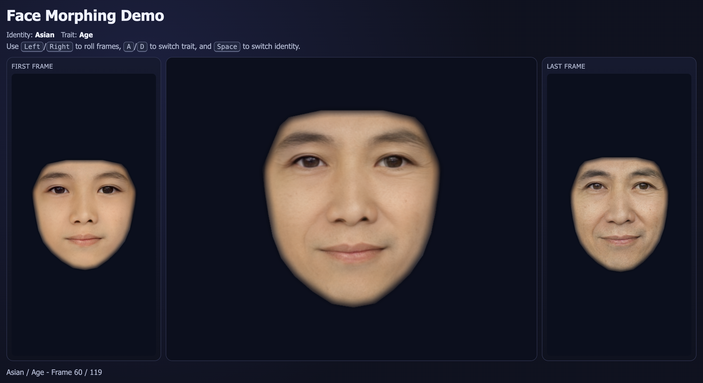

# Face Morphing Demo

## Preview



## Run

From this folder:

```powershell
python -m http.server 8000
```

Open:

```text
http://localhost:8000
```

## Folder Structure

```text
images/
  <Identity>/
    <Trait>/
      frame_0001.png
      frame_0002.png
      ...
```

- Identity = first folder level (example: `Asian`, `Black`)
- Trait = second folder level (example: `dominant`, `trustworthy`)
- Frames inside each trait folder are the morphing continuum

## Controls

- `Left Arrow`: move toward first frame (stops at first frame)
- `Right Arrow`: move toward last frame (stops at last frame)
- `A`: previous trait (wraps)
- `D`: next trait (wraps)
- `Space`: next identity (wraps)
